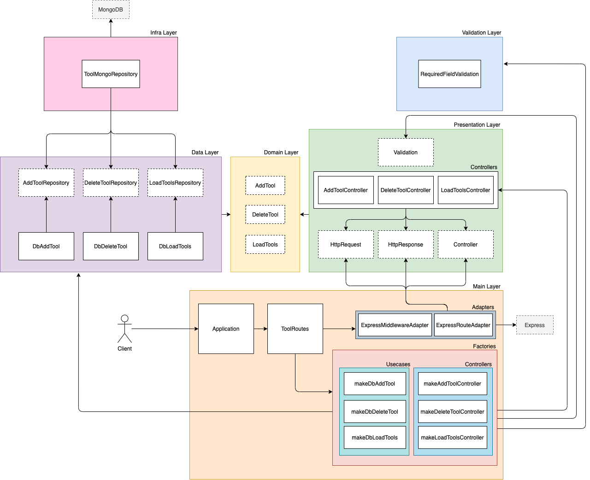

  

# Very Useful Tools to Remember (VUTTR)

This application is a simple repository to manage tools with its names, links, description and tags. It also has a user registration to authenticate and give access to the API.

> Developed by Lucas Cotrim Machado 
>> E-mail: lucascotrim3@hotmail.com

> ## Docs

* [Swagger](http://18.230.56.129:3000/docs/swagger "Swagger API Very Useful Tools to Remember") (deployed on AWS)

* [Postman](./public/postman/) 

> ## Usecases

- Users
  - [Signin](./requirements/users/signin.md)
  - [Add User](./requirements/users/add-user.md)
  - [Delete User](./requirements/users/delete-user.md)
  - [Load Users](./requirements/users/load-users.md)

- Tools
	- [Add tool](./requirements/tools/add-tool.md)
	- [Delete Tool](./requirements/tools/delete-tool.md)
	- [Load Tools](./requirements/tools/load-tools.md)

> ## Environment Variables

Create a .env file on root directory with following environment variables (recommended):

`MONGO_URL=`\
`APP_PORT=`\
`JWT_SECRET=`\
`ROOT_USER_NAME=`\
`ROOT_USER_EMAIL=`\
`ROOT_USER_PASSWORD=`\
`MAX_PAGE_SIZE_PAGINATION=`\
`DEFAULT_PAGE_SIZE_PAGINATION=`\
`DEFAULT_CURRENT_SIZE_PAGINATION=`

 > All of these values are already set on application by default, but I recommend to change them through environment variables. 

If it is your first time starting the application, it will automatically create a root admin user on database. All routes are protected and need authentication. 

> ## Starting

* Install dependencies

	`npm install`
    
* Start application

	`npm start`

> ## Debugging

Make sure to have debugger configured on your text editor or IDE. 

* For watch directories changes, run the following command in a separate terminal bash: 

	`npm run watch`

* Debug mode with Docker (make sure Docker is installed and running)
	
    `npm run up`
    
* Debug mode without Docker
	
    `npm run debug`

> ## Testing

On terminal you can run the following commands: 

* General Tests
	
	`npm test`
    
* Coverage Tests

	`npm run test:ci`
    
* Verbose Tests (more detailed)

	`npm run test:verbose`
    
* Staged Tests (uncommitted files)

	`npm run test:staged`
    
* Unit/Integration Test (changed files)

	`npm run test:unit`

	`npm run test:integration`

> ## How it was built

* NodeJs
* Typescript
* Express
* MongoDB
* Jest
	* Unit Tests
	* Integration Tests	 
	* Coverage Tests
	* Mocks
	* Spies
* Swagger
* Travis CI
* Docker

> ## Extra Libraries and Tools

* bcrypt
* jsonWebToken
* faker
* dotenv
* coveralls
* validator
* supertest
* husky
* lint-staged
* eslint
* standard-javascript-style
* nodemon
* rimraf
* In-Memory MongoDb Server
* module-Alias

> ## Application Architecture

###### Tools Example

